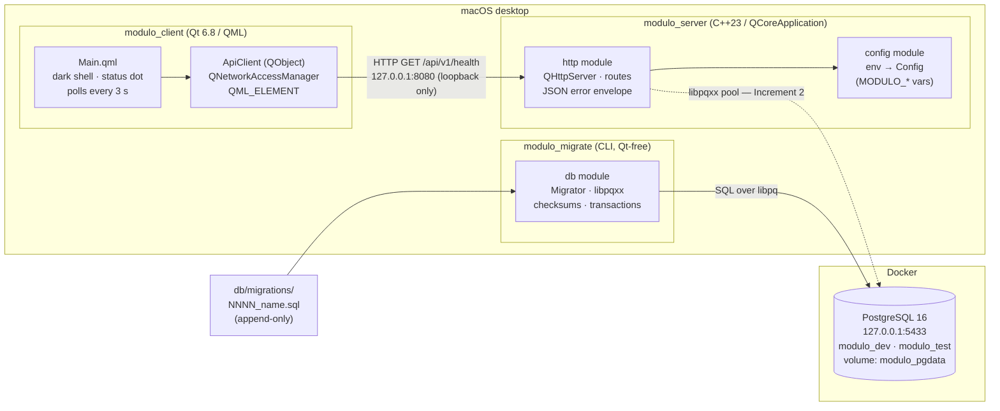
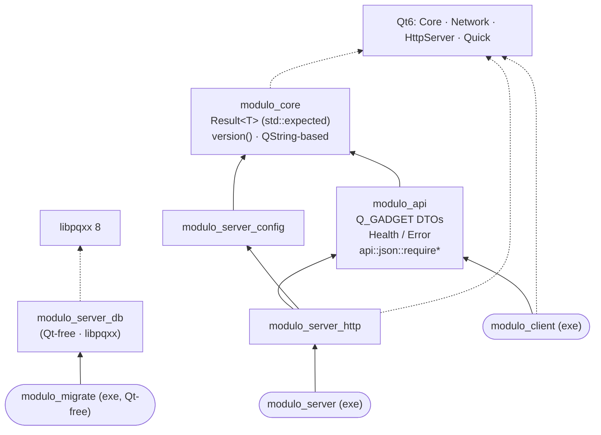
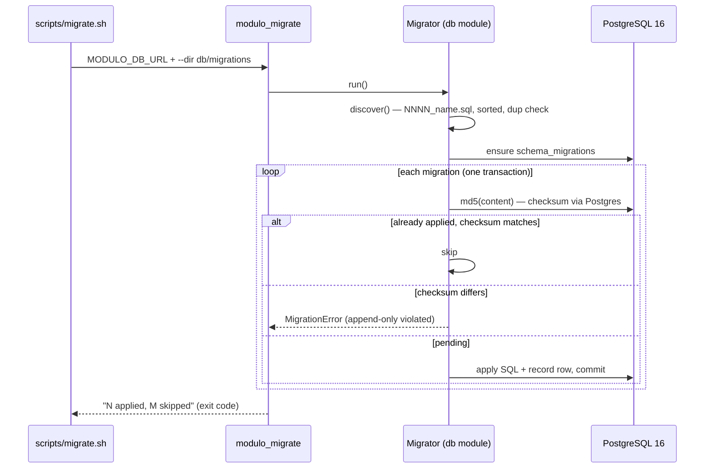

# Modulo — High-Level Design (end of Increment 1, Step 5)

## 1. Component & deployment view



## 2. Static library dependency graph



Every server-side module is its own static library (`CMakeLists.txt` + `include/modulo/...` + `src/`),
created by the `modulo_*` CMake toolkit functions (warnings, sanitizers, clang-tidy, version
injection, qt.conf generation applied uniformly). Coming next: `modulo_server_auth` (Increment 2),
then transactions / transfers / holdings / rates / documents as sibling modules.

## 3. Runtime flow — health check (the pipe proven in Step 5)

```mermaid
sequenceDiagram
    participant Q as Main.qml (Timer 3 s)
    participant A as ApiClient
    participant S as QHttpServer route
    participant D as modulo_api DTOs

    Q->>A: checkHealth()
    A->>S: GET /api/v1/health
    S->>D: HealthResponse{ok, 0.1.0}.toJson()
    S-->>A: 200 {"status":"ok","version":"0.1.0"}
    A->>D: HealthResponse::fromJson (validating)
    D-->>A: Result&lt;HealthResponse&gt;
    A-->>Q: serverReachable / serverStatus properties
    Note over Q: green pulsing dot · "server ok (v0.1.0)"
```

## 4. Runtime flow — migrations



**Conventions locked in so far:** full-Qt uniformity (QJson wire format, `QString`/`.arg()`,
`quint16`, `qInfo`/`qCritical`; `QLoggingCategory` from Increment 2) with `std::expected`/
`std::filesystem` where Qt has no equivalent; the only Qt-free zone is `modules/db` +
`modulo_migrate`; uniform error envelope `{"error":{"code","message"}}`; loopback-only
binding; append-only migrations; one step per prompt, README updated every step.
