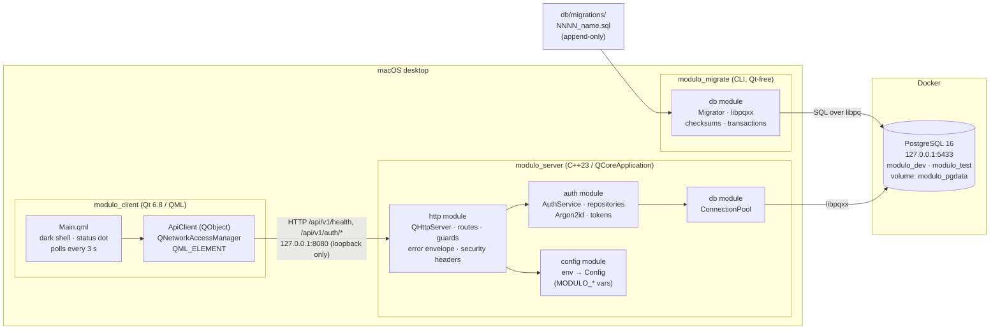
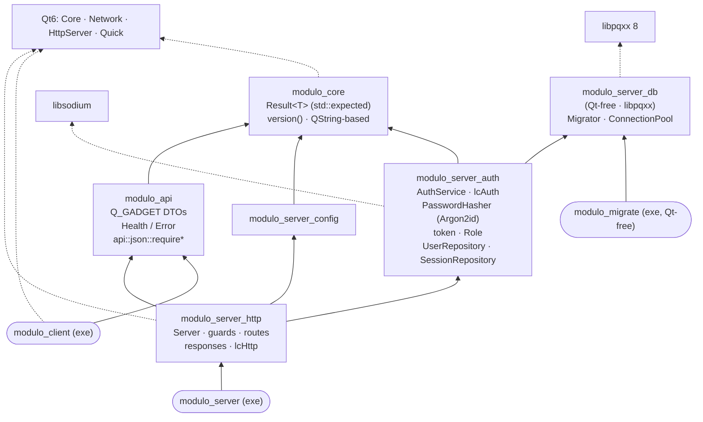
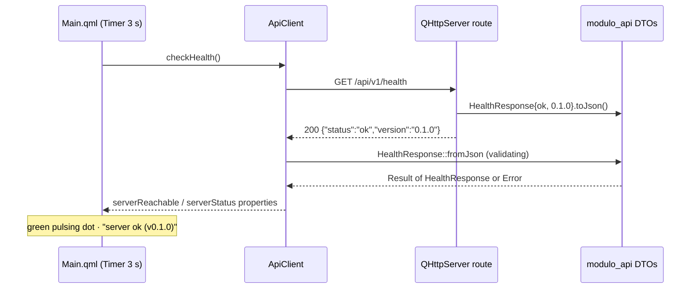
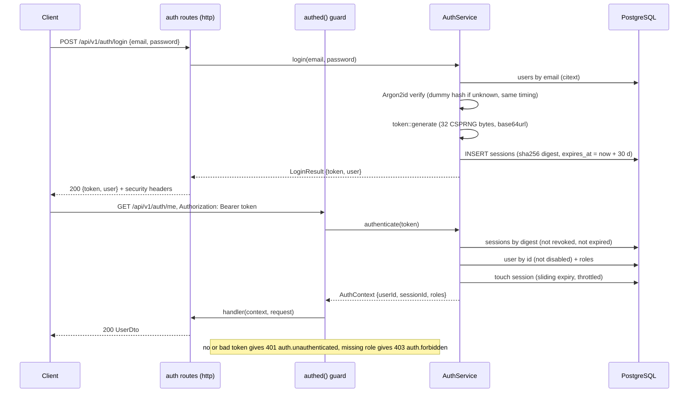
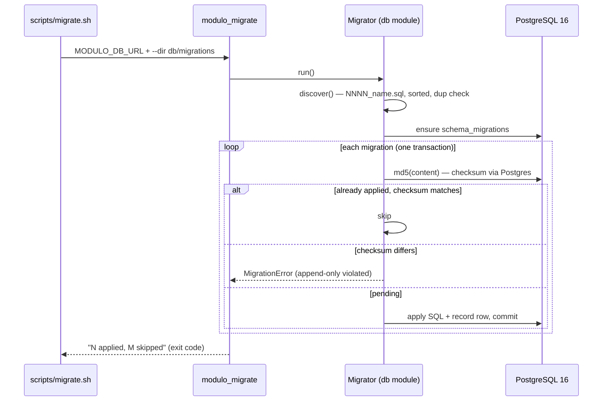
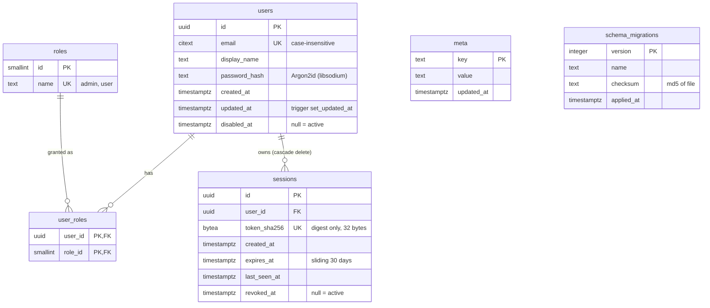
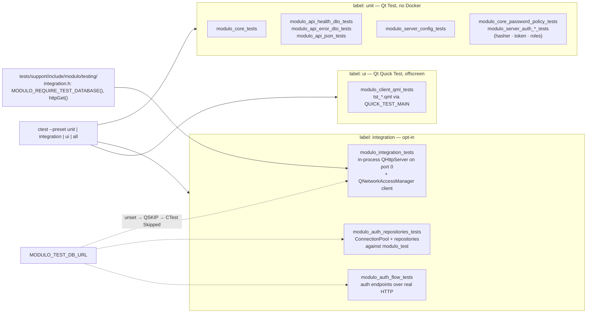

# Modulo — High-Level Design

## 1. Component & deployment view

## 2. Static library dependency graph

Every server-side module is its own static library (`CMakeLists.txt` + `include/modulo/...` + `src/`),
created by the `modulo_*` CMake toolkit functions (warnings, sanitizers, clang-tidy, version
injection, qt.conf generation applied uniformly). `modulo_server_auth` holds the crypto and data layer
of Increment 2; the HTTP routes that use it (service + guards) are wired through `modulo_server_http`
next. Transactions / transfers / holdings / rates / documents follow as sibling modules.

## 3. Runtime flow — health check

## 4. Runtime flow — login and an authenticated request

## 5. Runtime flow — migrations

## 6. Data model

Migrations so far: `0001_init` (meta), `0002_auth` (users, roles, user_roles, sessions, `set_updated_at()` trigger,
`citext` extension). `schema_migrations` is not created by a migration file — the migration engine
(`modules/db`, `migrator.cpp`) creates it on first run and owns it. Tokens are never stored: the server keeps only the SHA-256 digest, so a database leak cannot
be replayed as a login.

## 7. Test architecture

Conventions: one `QObject` test class per binary (`QTEST_GUILESS_MAIN`), data-driven rows via
`_data()` slots; each target's `tests/` directory is auto-discovered by the CMake toolkit, which
links `Qt6::Test`, adds the shared support include dir, and maps Qt Test's `SKIP   :` output to
CTest's *Skipped* status. Cross-module integration tests live only in `server/tests/integration/`.
